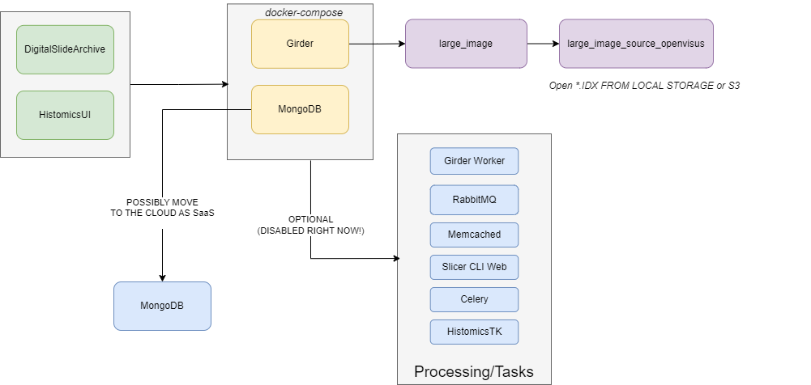

# Instructions

How to deploy an HistomicsUI with OpenVisus support.

Notes:
- our deployment does NOT support tasks/processing/workers. It's a minimal DigitalSlideArchive (DSA) deployment

Links:
- https://github.com/DigitalSlideArchive/digital_slide_archive/tree/master/devops/minimal
- https://github.com/girder/large_image
- https://github.com/DigitalSlideArchive/HistomicsUI




# Create OpenVisus large image plugin

For Windows:

```bash
set PATH=%PATH%;c:\python310

# create a virtual environment with all development packages
python.exe -m venv .venv
.venv\Scripts\activate
python -m pip install --upgrade pip
python -m pip install pooch wheel twine large-image[common] girder-large-image OpenVisusNoGui

# this is the develop mode
python -m pip install -e .

# test if the OpenVisus plugin works well
# BROKEN right now (confusion between Girder and LargeImage plugin API). Not important?
# python test.py D:/visus-datasets/david_subsampled/visus.idx ~test.png
```

Create and upload wheel
- **CHANGE the setup.py to contain the right project version**
- **ALSO CHANGE deploy/Dockerfile**

```bash
del dist\*
python setup.py bdist_wheel
twine upload dist/*.whl
```

## HistomicsUI

Before starting
- **Edit the Dockerfile and change the OpenVisus plugin version as needed**

(OPTIONAL) Preliminary clean all the stuff
- NOTE: **this will destroy any existing data**

```bash
cd deploy
docker-compose down --volumes
docker stop $(docker ps -a -q)
docker container prune
docker volume rm $(docker volume ls -q)
```


Connect using the browser:
- NOTES: **DO NOT USE 0.0.0.0  since it does NOT work in WSL2**

```ini
URL=http://localhost:8080  
USERNAME=admin
PASSWORD=password
```

To Run in production:

```bash
cd deploy
docker-compose build
docker-compose up
```


To Run in debug mode

```bash

cd deploy
docker-compose build

# start mongodb in background
docker-compose up -d mongodb

# create a background container so I can attach using VS COde
docker compose run -d --entrypoint="sleep 999999999999" girder 

# **Attach in VS Code `Attach to running container`**

# this may be slow the first time, because it needs to download some `Samples` data
python /provision.py --sample-data --slicer-cli-image= 

# run the web server
code /usr/local/lib/python3.10/site-packages/large_image_source_openvisus/__init__.py

# OPTIONAL disable/enable caching
code /etc/girder.cfg 

# [large_image]
# cache_backend, used for caching tiles, is either "memcached" or "python"
# cache_backend = "python"
# 'python' cache can use 1/(val) of the available memory
# cache_python_memory_portion = 0

girder serve --dev --database "mongodb://mongodb:27017/girder?socketTimeoutMS=3600000"

# in a split window check logs
tail -f ./.girder/logs/*.log 
```


### Add a Local OpenVisus dataset

- remember to mount the datasets as a volume using `docker-compose.yml`
- go to `Admin Console` 
- Click `AssetsStores`
- Click `Import Data`:

```ini
Import_Path=/visus-datasets/david_subsampled/visus.idx # data must be mounted inside the Docker container
Destination_ID=Select Samples/Images
```

Now you should see the dataset and it should work.


### Add a remove OpenVisus dataset

- You need to have all the files in a bucket (i.e. the current Girder import seems not to pull updates from a bucket)
- go to `Admin Console` 
- Click `AssetsStores`
- Click on  an `Create new Amazon S3 assetstore`

```ini
Assetstore_name=openvisus_s3_assetstore

# the bucket must pre-exists
S3_bucket_name=visus-datasets

# leave empty, or check if you need a prefix like for Seal Storage
Prefix= 

# change as needed
Access_Key=XXXXX
Secret_Access_Key=YYYYY
Service=s3.us-west-1.wasabisys.com
Region=us-west-1
```

Now import data
- Click on "Import Data" on the new S3 assets store section
- You may import a specific directory of keys within the bucket, or a specific key by path 
  - If you wish to import the entire bucket into the selected destination, simply leave the import path field blank
  - If you specify a directory, it will be imported recursively.

```ini
#  s3://visus-datasets/arco/david_subsampled/visus.idx
Import_path=arco/david_subsampled/visus.idx

Destination_ID=Select Samples/Images
```

As you access the data, you will see the cache directory `/root/visus/cache` growing 

### Create and upload arco dataset

```bash

# convert to arco
python3 -m OpenVisus copy-dataset --arco 2mb /usr/sci/cedmav/visus1/data/david/david_subsampled.idx ./tmp/david_subsampled/visus.idx

# compress (IMPORTANT!)
python3 -m OpenVisus compress-dataset ./tmp/david_subsampled/visus.idx

# sync to S3
aws --profile wasabi s3 sync --endpoint-url https://s3.us-west-1.wasabisys.com ./tmp/david_subsampled/ s3://visus-datasets/arco/david_subsampled/
```


### MongoDB

(OPTIONAL) Install MongoDB client:

```bash
wget -qO- https://www.mongodb.org/static/pgp/server-7.0.asc | sudo tee /etc/apt/trusted.gpg.d/server-7.0.asc
echo "deb [ arch=amd64,arm64 ] https://repo.mongodb.org/apt/ubuntu bionic/mongodb-org/7.0 multiverse" | sudo tee /etc/apt/sources.list.d/mongodb-org-7.0.list
sudo apt-get update
sudo apt-get install -y mongodb-mongosh
```

Connect to mongodb

```bash
mongosh

show dbs
use girder
show collections
db.assetstore.find()
db.file.find()
```

